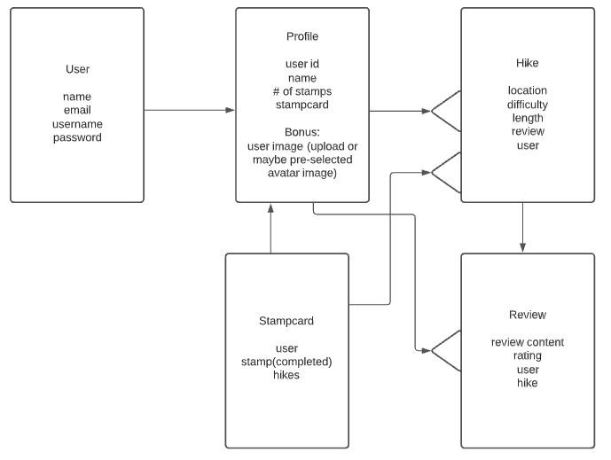
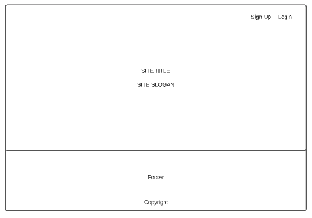
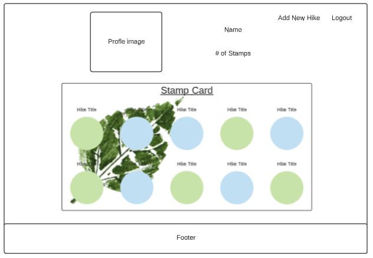
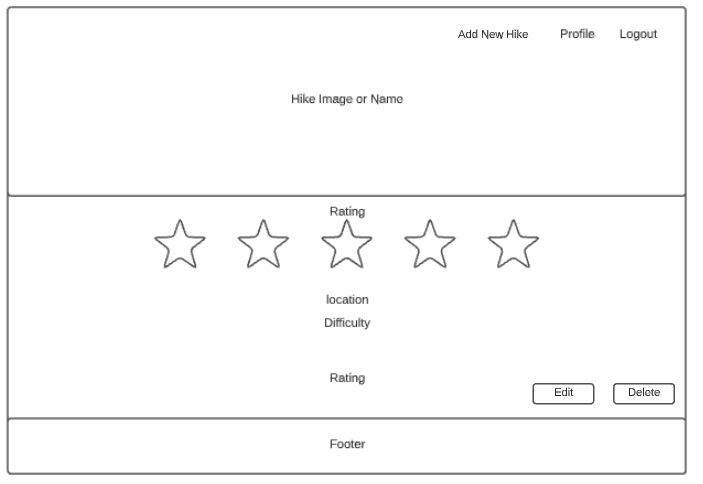
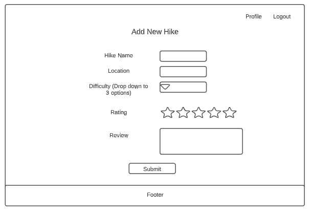
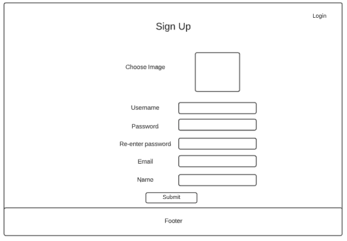

# Trail Stamp

## User Story
This app allows users to rate hikes they’ve been on and check them off their “hike” list. 

If a user is not logged in, they will see the site’s landing page which contains some information about the site as well as options to Sign Up or Login. The leaf stamp in the upper left hand corner, when clicked, will always take the user back to the home page.

When a user signs up for the site, they will be asked to enter a username, password, email, name, and be given a choice of a few avatar icons to choose from. Once logged in, options for Profile, Add Hike, and Logout will replace the previous text in the nav bar.

Once a user is logged in, they will be taken to their profile which will show their user avatar, name, and stamp card. The stamp card will have icons on it with the picture (or default picture) of the hike. Hikes that the user has already completed will have “stamps” in those icons to indicate that the user has done this hike before and reviewed it. The user may only view hikes which they have added.

Clicking on these circles will bring you to the hike’s show page which will display an image, the name of the hike, the location of the trail, and the difficulty of the hike. If the hike has been marked as completed, this page will also show the user’s rating of the hike (out of 5), and a written review of the hike with any notes the user would like to add. There will be an option to edit or delete the hike review. Deleting the hike review will remove the circle from the user’s stamp card as well as removing the hike show page.

A user may add a hike they would either like to do or have already completed. If the user checks the “completed” box, they will have the option to then leave a rating out of 5 stars and a written review.

## Wireframes

### ERD

### Home Page

### Profile Page

### Hike Show Page

### Add HikePage

### Sign Up Page

## Technologies Used
- HTML5
- CSS3
- JavaScript
- React.js
- Node.js
- Express
- MongoBD
- Mongoose

## Instillation
- npm init
- npm i
- npm i react-router-dom
- npm i mongoose
- npm i express
- npm i jsonwebtoken
- npm i jwt-decode
- npm i axios

## Attributions and Acknowledgements

### Special thanks to Adonis Martin, Derek Oshita, Kenny Bushman, Michael Petty, Nate Daniels, Yulia Tsernant, and Zach Milan.

### Images:

Icons made by <a href="https://www.flaticon.com/authors/freepik" title="Freepik">Freepik</a> from <a href="https://www.flaticon.com/" title="Flaticon"> www.flaticon.com</a>
Plant, Tree, Sun, Lizard, Fox, Fish, Flower

Icons made by <a href="https://www.flaticon.com/authors/good-ware" title="Good Ware">Good Ware</a> from <a href="https://www.flaticon.com/" title="Flaticon"> www.flaticon.com</a>
Leaf

Icons made by <a href="http://www.freepik.com/" title="Freepik">Freepik</a> from <a href="https://www.flaticon.com/" title="Flaticon"> www.flaticon.com</a>
Beaver, Snake

{e.target.onerror = null; e.target.src="image_path_here"}}/>

https://www.uokpl.rs/fpng/f/9-97476_transparent-background-white.png 
Stamp Circle

https://encrypted-tbn0.gstatic.com/images?q=tbn%3AANd9GcRz0bxMkl2_ggkVpKeI3VhQtYwwt0hjzTI8Eg&usqp=CAU
Leaf Stamp

https://unsplash.com/photos/DmVDrTLFHBw

https://unsplash.com/photos/LEgwEaBVGMo

https://unsplash.com/photos/Yizrl9N_eDA

https://unsplash.com/photos/UVyOfX3v0Ls

## Unresolved Issues
- The stamp icons overlap. This will be adjusted so that they sit in an orderly grid.
- Upon signing up, the user is not automatically logged in and must do so manually. This will be adjusted so that the user is immediately logged in upon signing up.
- Upon login and the creation of a hike, the hike icon(s) do not immediately appear. They do so when the browser is refreshed. This will be adjusted so that these elements render immediately upon page load.

## Future Features
- A feature where the user may input the coordinates of the hike which will be pinned on a map component within the hike's show page
- The user rating for hikes will be shown as filled stars out of five.
- Users will be able to leave reviews on other user's added hikes and will be able to see other users and their respective reviews on hikes.
- Users will be able to edit their user data.
- Users will be able to upload an image for their profile picture as well as an image (or images) for the hikes they add.